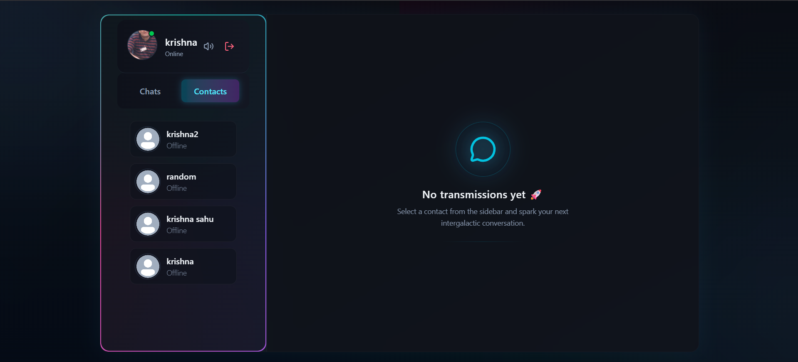

<h1 align="center">💬 ChatVora — The Next-Gen Real-Time Chat Application</h1>

<p align="center">
  
</p>

---

ChatVora is a **modern full-stack real-time chat platform** built for speed, interactivity, and reliability — combining a beautiful UI with powerful backend features.  
Designed and developed by **Krishna**, this app pushes the limits of what a chat experience can feel like. ⚡

---

## 🌌 Overview

ChatVora lets users sign up, chat in real-time, share images, get notifications, and see who’s online — all in a **sleek, modern, and highly responsive interface**.

It uses **custom JWT authentication**, **Socket.io** for instant communication, and **Cloudinary** for secure image handling — all backed by **MongoDB** and **Express.js**.

---

## ✨ Features

### 🧠 Core Functionality
- 🔐 **Custom JWT Authentication** (no third-party auth)
- ⚡ **Real-time Messaging** via **Socket.io**
- 🟢 **Online / Offline Presence Indicators**
- 🔔 **Notification & Typing Sounds** *(with toggle switch)*
- 📨 **Welcome Emails on Signup** powered by **Resend**
- 🗂️ **Image Uploads** integrated with **Cloudinary**
- 🧰 **REST API** built using **Node.js & Express**
- 🧱 **MongoDB** for Data Persistence
- 🚦 **API Rate-Limiting** powered by **Arcjet**
- 🎨 **Modern UI** using **React, Tailwind CSS & DaisyUI**
- 🧠 **State Management** using **Zustand**
- 🧑‍💻 **Git & GitHub Workflow** with branches, PRs & merges
- 🚀 **Easy Deployment** (Free-tier friendly with Sevalla)
- ⚙️ **Environment-based Configurations**
- 🎧 **Keyboard & Message Sound Effects**
- 🌗 **Dark/Light Mode Transitions**
- 💫 **Smooth Animations** (optimized for performance)

---

## 🧱 Tech Stack

**Frontend**
- React (Vite)
- Tailwind CSS
- DaisyUI
- Zustand (state management)
- React Hot Toast (notifications)
- Lucide Icons

**Backend**
- Node.js
- Express.js
- MongoDB + Mongoose
- Socket.io
- JWT Authentication
- Resend (emails)
- Cloudinary (media uploads)
- Arcjet (API protection)

**Deployment**
- Frontend: Vercel / Netlify
- Backend: Render / Sevalla
- Database: MongoDB Atlas

---

## ⚙️ Environment Setup

Create a `.env` file in your **backend root directory** and configure it as below:

```bash
PORT=your_port_number
MONGO_URL=your_mongodb_connection_string
JWT_USER_SECRET=your_jwt_secret
NODE_ENV=production | development
RESEND_API_KEY=your_resend_api_key
EMAIL_FROM="onboarding@resend.dev"
EMAIL_FROM_NAME="CHATVORA"
CLIENT_URL="your_frontend_url"
CLOUDINARY_CLOUD_NAME="your_cloudinary_cloud_name"
CLOUDINARY_API_KEY="your_cloudinary_api_key"
CLOUDINARY_API_SECRET="your_cloudinary_api_secret"

---

## 🚀 Installation Guide

🖥️ Clone the Repository

git clone https://github.com/yourusername/chatvora.git
cd chatvora

⚙️ Backend Setup

cd server
npm install
npm run dev

💻 Frontend Setup

cd client
npm install
npm run dev

Now open ➜ http://localhost:5173

---

## 🧩 Folder Structure

chatvora/
├── client/                # Frontend React app
│   ├── src/
│   │   ├── components/
│   │   ├── pages/
│   │   ├── store/
│   │   └── assets/
│   ├── public/
│   └── package.json
│
├── server/                # Backend Node.js + Express app
│   ├── controllers/
│   ├── models/
│   ├── routes/
│   ├── middleware/
│   ├── utils/
│   ├── .env.example
│   └── server.js
│
├── README.md
└── package.json

---

🧠 How It Works
🔐 Signup / Login

- Securely handled via custom JWT authentication.

- Sends welcome email using Resend API.

💬 Messaging

- Real-time Socket.io events for message delivery.

- Messages stored in MongoDB for persistence.

- Sound & typing indicators for immersive experience.

🖼️ Media Handling

- Images uploaded to Cloudinary.

- URLs stored and fetched in chat threads.

🟢 Online Presence

- Socket.io detects online/offline users.

- Displayed with green (online) or gray (offline) dots.

🧰 Performance & Security

- API rate-limiting with Arcjet.

- Optimized UI transitions and socket connections.

---

## 🧪 Development Commands
Command	Description
npm run dev	Run in development mode
npm run build	Build for production
npm run start	Start production server
npm run lint	Check for linting errors

---

## 🌍 Deployment Tips

Use Vercel for the React frontend.

Use Render or Sevalla for the Node.js backend.

Use MongoDB Atlas for database hosting.

Ensure .env variables are configured properly on all platforms.

---

##🧑‍💻 Author

Developed by: Krishna
📧 Email: krishna.sahu.work@gmail.com

💼 Passionate Full Stack Developer | Focused on real-time web apps, AI-driven UI, and futuristic experiences.

---

🪩 License

This project is open-source under the MIT License.
Feel free to fork, enhance, and contribute — just don’t forget to ⭐ the repo!

---
##💫 Acknowledgements

Socket.io

Cloudinary

Resend

Tailwind CSS

Zustand

MongoDB Atlas

Arcjet

<h3 align="center">💬 ChatVora — Where Conversations Feel Alive.</h3> ```